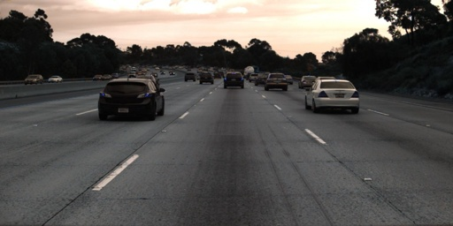
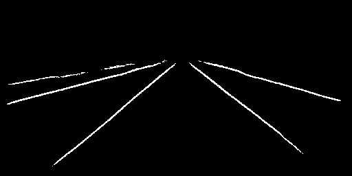
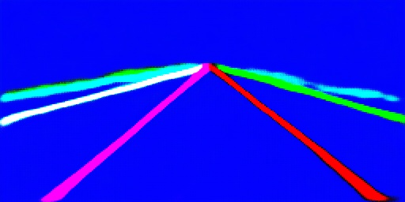

# Lanenet-Lane-Detection (基于pytorch的版本)

[English Version](https://github.com/IrohXu/lanenet-lane-detection-pytorch/blob/main/README.md)    


## 简介     
在本项目中，使用pyotrch复现了 IEEE IV conference 的论文 "Towards End-to-End Lane Detection: an Instance Segmentation Approach"，并对这篇论文的思想进行讨论。   
开发这一项目的初衷是，在github上开源的LaneNet项目数目较少，其中只有基于tensorflow 1.x的项目https://github.com/MaybeShewill-CV/lanenet-lane-detection 能够完整的实现作者论文中的思想，但是随着tensorflow 2.x的出现，基于tensorflow 1.x的项目在未来的维护将会越来越困难，很多刚入门深度学习同学也不熟悉tensorflow 1.x的相关功能。与此同时，github上基于pytorch的几个LaneNet项目或多或少都存在一些错误，例如错误复现Discriminative loss导致实例分割失败，且相关作者已经不再维护。   

LaneNet的网络框架:    


## 生成用于训练和测试的Tusimple车道线数据集      
在此处下载Tusimple数据集： [Tusimple](https://github.com/TuSimple/tusimple-benchmark/issues/3).  
运行以下代码生成可以用于训练的数据集形式： 
仅生成训练集：   
```
python tusimple_transform.py --src_dir path/to/your/unzipped/file --val False
```
生成训练集+验证集:    
```
python tusimple_transform.py --src_dir path/to/your/unzipped/file --val True
```
生成训练集+验证集+测试集:    
```
python tusimple_transform.py --src_dir path/to/your/unzipped/file --val True --test True
```
path/to/your/unzipped/file应该包含以下文件:    
```
|--dataset
|----clips
|----label_data_0313.json
|----label_data_0531.json
|----label_data_0601.json
|----test_label.json
```

## 训练模型    
在示例的文件夹中运行训练代码，注意，使用示例数据并不能真正训练出可以用的LaneNet，因为示例文件只有6张图像:   
```
python train.py --dataset ./data/training_data_example
```
使用Tusimple数据集训练模型，path/to/tusimpledataset/training为Tusimple数据集训练集的路径:   
```
python train.py --dataset path/to/tusimpledataset/training
```
使用Tusimple数据集/DeepLabv3+训练模型:   
```
python train.py --dataset path/to/tusimpledataset/training --model_type DeepLabv3+
```

## 测试    
使用我在NVIDIA RTX 2070上训练好的模型，仅仅训练了25个epoch，但已经具备一定的预测效果。         
测试模型，以示例数据的测试图像为例:    
```
python test.py --img ./data/tusimple_test_image/0.jpg
```

在我的电脑上测试的效果:    
    
    
    


## 讨论分析:    
更新日志：    
    
2021.7.16更新    
增加了DeepLabv3+作为LaneNet的Encoder和Decoder,实际效果未测试。    

2021.7.22更新    
增加了Focal Loss。     


待更新
